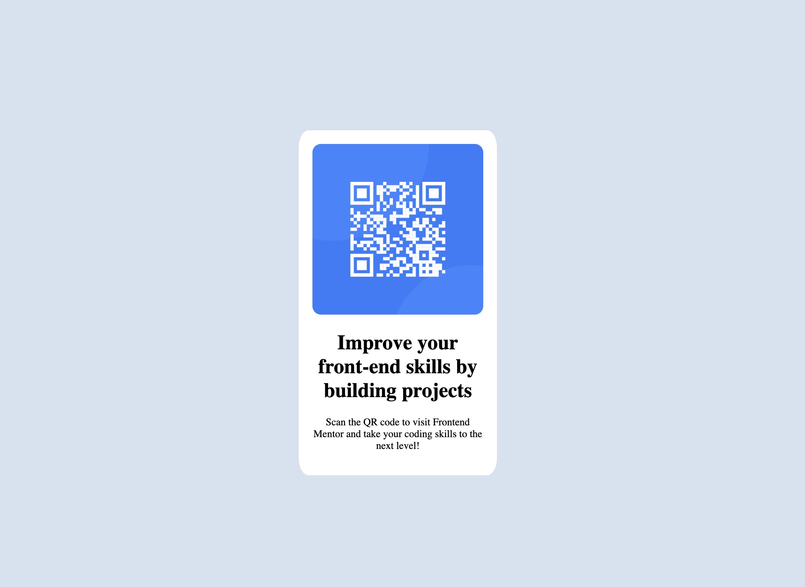

# Frontend Mentor - QR code component solution

This is a solution to the [QR code component challenge on Frontend Mentor](https://www.frontendmentor.io/challenges/qr-code-component-iux_sIO_H). Frontend Mentor challenges help you improve your coding skills by building realistic projects.

## Table of contents

- [Overview](#overview)
  - [Screenshot](#screenshot)
  - [Links](#links)
- [My process](#my-process)
  - [Built with](#built-with)
  - [What I learned](#what-i-learned)
  - [Continued development](#continued-development)
  - [Useful resources](#useful-resources)
- [Author](#author)
- [Acknowledgments](#acknowledgments)

**Note: Delete this note and update the table of contents based on what sections you keep.**

## Overview

### Screenshot

### Links

- Solution URL: [Add solution URL here](https://your-solution-url.com)
- Live Site URL: [Add live site URL here](https://your-live-site-url.com)

## My process

### Built with

- Semantic HTML5 markup
- CSS custom properties
- CSS Grid

### What I learned

Use this section to recap over some of your major learnings while working through this project. Writing these out and providing code samples of areas you want to highlight is a great way to reinforce your own knowledge.

I learned how to use css grid to position elements on the page. The resource link and wes bos css grid course helped a lot. Using the grid lines in the browser dev tools are super helpful getting the layout right. What I would like to pracrtice moving forward is setting up the grid layout with names and then plaacing the sections where they go. The figma designs are helpful but it was tricky dealing with the generated coded. I ended up just coding everything by hand, but looking at the generated code did help me get an idea on how to layer the divs together.

If you want more help with writing markdown, we'd recommend checking out [The Markdown Guide](https://www.markdownguide.org/) to learn more.

### Continued development

Use this section to outline areas that you want to continue focusing on in future projects. These could be concepts you're still not completely comfortable with or techniques you found useful that you want to refine and perfect.

- creating entire grid layouts
- more comfortablility with git
- more practice with Figma

**Note: Delete this note and the content within this section and replace with your own plans for continued development.**

### Useful resources

- https://css-tricks.com/snippets/css/complete-guide-grid/ - This helped me figure out how to center the content using grid. This will be a quick resource to use as a cheat sheet.
- w3schools.com

## Author

Chris Spencer

- Website - [Add your name here](https://www.your-site.com) - no portfilio yet
- Frontend Mentor - [@TheRealSoulz61V](https://www.frontendmentor.io/profile/TheRealSoulz61V)
- instagram - [@soulzdesign](https://www.twitter.com/yourusername)
